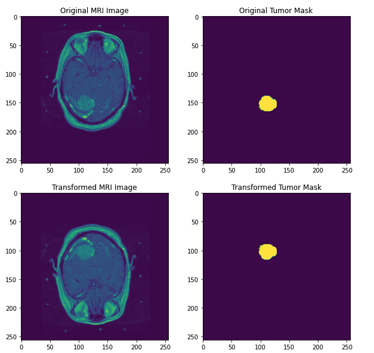

# Local-Control-Prediction

#### Team
[Anish Mukherjee](https://github.com/anmuai), [Young Zeng](github.com/youngzyx)

## Background
We were working on this project during our internship at University of California, San Francisco. The main task for this project is to predict the local control from three different types of data: image data, clinical data, and radiomics data.  

`Local control` After stereotactic radiosurgery such as gamma knife, if certain brain metastasis does not locally recur, then that would be local control. Otherwise that would be local failure. 

The image model is under the following hypothesis:
 > Local control, ignorin gother factors such as KPS, age, histology, total met count/volume, can be ifnluenced both by position of the lesion and the proximity  of other leisions in the brain.
  
## Dataset
`Image data` 8461 3D MRI images with brain tumors and their masks.  
`Clinical data` 8407 tabular dataset with clinical features.  
`Radiomics data` 8407 tabular dataset with radiomics features.  

 

## Methodology
Modelling with three differet types of data respectively, then we model with the combination of clinical data and other types of data.

### Image Models
We tried different architectures of Convolutional Neural Network model such as UNet, ResNet 50. 
| Architecture|Best Accuracy|Best Area under ROC|
|:-----------|:------------:|:--------:|
|[UNet+Linear](UNet_Linear.ipynb)|0.9125|0.5992|
|[Half_UNet+Linear](Half_UNet_Linear_balancing.ipynb)|0.5073|0.5568|
- [Intuition of convolution](https://towardsdatascience.com/intuitively-understanding-convolutions-for-deep-learning-1f6f42faee1)
- Why do we use AUC-ROC:
  The AUC_ROC curve is defined as True Positive rate over False Positive rate at various threshold setting. It tells how much the model is capable to distinguish different classes. When AUC-ROC closed to 1 that means the model does well in separating 1 and 0. When the score closed to 0 that means the model is predicting the negative class as as positive class and vice versa. When the score is closed to 0.5, that means the model cannot separate them well. 
[Some good explanation](https://towardsdatascience.com/understanding-auc-roc-curve-68b2303cc9c5)
  The label for this model is failure, which means 1 indicates the gamma surgery will fail. Therefore, we care a lot about the False Positive rate because that might mistakenly pursuade a patient who will fail that surgery to take the surgery. 

### Models for tableau data
Since both clinical and radiomics data are tabular data. It would be easier for us to model them together. We used gradient boosting model from scikit learn, xgboost, and random forest models.

|Data|Model|
|:---|----:|
|[Clinical](Gradient_Boosting_clinical&radiomic.ipynb)|Gradient Boosting|
|[Radiomics](Gradient_Boosting_clinical&radiomic.ipynb)|Gradient Boosting|
|[Clinical+Radiomics](Gradient_Boosting_clinical&radiomic.ipynb)|Gradient Boosting|
